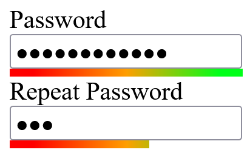

# Javascript-Password-Strength-Indicator

This is **initial pre version** of this library.



## Installation
In order to use this library, [download zip file](https://github.com/NouvelleTechno/Javascript-Password-Strength-Indicator/releases) and copy necessary files from `dist` folder into your assets folder.

## Usage
### Include library
To use the library, start by including the main file into `head` section of your project.

**Don't include anything else**

```html
<script type="module" src="your_directory/strength-indicator.min.js"></script>
```